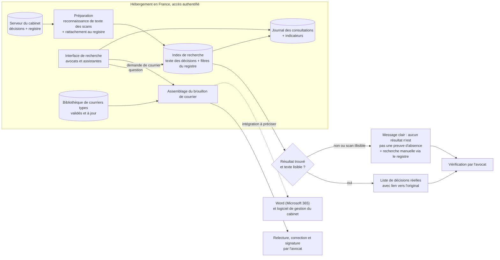

# Schéma d'architecture cible — Cabinet Maître Devalle

**Composants**
1. **Serveur du cabinet** : source unique des décisions et du registre, déjà existant. Rien n'est envoyé hors de France.
2. **Préparation** : transforme les anciens scans en texte lisible (reconnaissance automatique de texte) et rattache chaque décision à sa ligne du registre (matière, date, issue).
3. **Index de recherche** : un moteur de recherche dans le texte des documents, combiné aux filtres du registre. Il ne renvoie que des documents qui existent.
4. **Interface de recherche** : accès par identifiant pour les avocats et assistantes. Chaque résultat ouvre le document d'origine.
5. **Bibliothèque de courriers types** : modèles à jour, validés par un avocat, à la place des vieux courriers copiés-collés. L'assemblage remplit un brouillon que l'avocat relit et signe.
6. **Journal et indicateurs** : trace des consultations (secret professionnel) et mesure du temps de recherche et du taux de décisions retrouvées (§6).

**Où les risques 🔴 sont traités**
- **Décision inventée** : l'index ne renvoie que des documents réels, avec lien vers l'original. L'avocat vérifie (nœud « Vérification par l'avocat »).
- **Secret professionnel** : tout est dans le périmètre « hébergement en France, accès authentifié », et le journal garde la trace des consultations.
- **Données de tiers et de mineurs** : pas de copie vers un service externe ; droits d'accès par dossier ou par matière à trancher avec le cabinet (§6).
- **Scans mal lus** : le nœud « résultat trouvé et texte lisible ? » évite qu'un silence soit pris pour une absence.

**Ce qu'on n'a PAS mis (et pourquoi)**
- **Modèle de langage qui rédige ou cite des décisions** : c'est le risque d'invention que la cliente exclut (« jamais chez nous »).
- **Assistant qui répond en langage naturel à partir des documents (RAG) et base de recherche par sens** : autre produit, avec un coût et un risque d'erreur en plus, pas nécessaire tant que la recherche dans le texte suffit.
- **Agents qui agissent seuls** : rien ne doit s'envoyer sans l'avocat.
- **Modèle entraîné sur les décisions du cabinet** : aucune donnée d'entraînement à exposer, et 2 000 décisions sans thème étiqueté ne le justifient pas.
- **Service hébergé hors de France** : refusé par la cliente.

**Sobriété en 3 lignes** : recommandation de départ, une recherche dans le texte des documents du cabinet, avec ses filtres, et une bibliothèque de courriers types à jour. Aucun modèle de langage à ce stade : le besoin est de retrouver des documents réels, pas d'en générer. Condition de bascule : si un essai sur un échantillon montre que la recherche par mots ne retrouve pas la bonne décision dans un taux à fixer avec le cabinet, on envisagera une aide à la recherche par un modèle hébergé en France, sans qu'il produise de citation (à évaluer avec la grille C4).

**Cohérence avec les KPI** : le journal et les indicateurs mesurent les chiffres du §6 (temps de recherche, décisions retrouvées, temps de rédaction d'un courrier).

**Imprévu de 14h30** : _à compléter après le message du client._