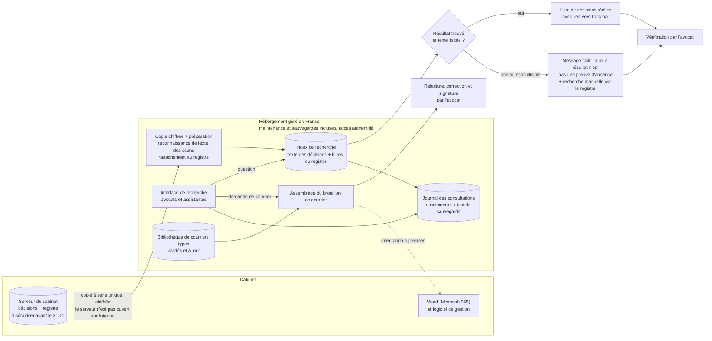

# Schéma d'architecture cible — Cabinet Maître Devalle

**Ce que l'imprévu a changé sur le schéma**
- Les briques de l'outil ne sont plus posées sur le serveur du cabinet : elles sont dans un **hébergement géré en France**, dont le contrat inclut mises à jour et sauvegardes.
- Le serveur du cabinet reste la **source** et n'est jamais ouvert sur Internet : il envoie une **copie chiffrée à sens unique**.
- Le journal suit aussi un **test de sauvegarde** (nouvel indicateur du §6).
- Option de bascule : si le cabinet déplace tout son serveur vers un stockage hébergé en France avec son futur prestataire, l'étape de copie disparaît et l'outil lit directement ce stockage.

**Composants**
1. **Serveur du cabinet** : source des décisions et du registre. Avant le 31/12 : sauvegarde testée, accès et documentation récupérés, accès du prestataire sortant révoqués.
2. **Copie et préparation** : copie chiffrée, reconnaissance automatique de texte des scans, rattachement à la ligne du registre (matière, date, issue).
3. **Index de recherche** : moteur de recherche dans le texte des documents, combiné aux filtres du registre. Il ne renvoie que des documents qui existent.
4. **Interface de recherche** : accès par identifiant ; chaque résultat ouvre le document d'origine.
5. **Bibliothèque de courriers types** : modèles à jour, validés par un avocat, assemblés en brouillon que l'avocat relit et signe.
6. **Journal et indicateurs** : consultations (secret professionnel), temps de recherche, décisions retrouvées, test de sauvegarde.

**Où les risques 🔴 sont traités**
- **Décision inventée** : seuls des documents réels sont renvoyés, avec lien vers l'original ; l'avocat vérifie.
- **Secret professionnel** : tout l'outil est dans un hébergement en France à accès authentifié, avec journal des consultations.
- **Serveur sans administrateur** : l'outil ne dépend pas du serveur pour tourner ; celui-ci n'est pas exposé ; sauvegarde testée.
- **Données de tiers et de mineurs** : copie limitée aux documents utiles, chiffrée, en France ; matière « famille » à part si le DPO l'exige ; droits par dossier à trancher (§6).
- **Scans mal lus** : le nœud « résultat trouvé et texte lisible ? » évite qu'un silence soit pris pour une absence.

**Tension à arbitrer avec le client** : la copie crée une seconde copie des décisions chez un hébergeur (sous-traitant, contrat à faire valider par le DPO). Laisser l'outil dépendre d'un serveur sans administrateur serait plus risqué. Décision à confirmer avec Maître Devalle (§6).

**Ce qu'on n'a PAS mis (et pourquoi)**
- **Modèle de langage qui rédige ou cite des décisions** : risque d'invention exclu par la cliente ; en plus, une brique de moins à maintenir pour un cabinet sans informaticien.
- **Assistant en langage naturel (RAG) et recherche par sens** : autre produit, coût et risque d'erreur en plus, inutile tant que la recherche dans le texte suffit.
- **Agents autonomes** : rien ne part sans l'avocat.
- **Modèle entraîné sur les décisions** : aucune donnée d'entraînement à exposer ; 2 000 décisions sans thème étiqueté ne le justifient pas.
- **Ouverture du serveur du cabinet sur Internet** et **service hors de France** : refusés (sécurité, demande de la cliente).

**Sobriété en 3 lignes** : une recherche dans le texte des documents du cabinet et une bibliothèque de courriers à jour, hébergées en France par un service maintenu. Pas de modèle de langage : le besoin est de retrouver des documents réels, pas d'en générer. Bascule : si la recherche par mots ne retrouve pas la bonne décision assez souvent sur 30 recherches de test, on envisagera une aide par un modèle hébergé en France, sans citation produite (grille C4).

**Cohérence avec les KPI** : le journal mesure les chiffres du §6 (temps de recherche, décisions retrouvées, sauvegarde).